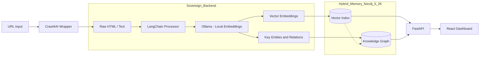

# EquiTracker

**A Sovereign AI News Tracker for Equity & Inclusion.**

EquiTracker is a local-first, privacy-focused intelligence platform that monitors, ingests, and analyzes news sources to track equity and inclusion metrics. Built on a "Hybrid Brain" architecture, it combines the deterministic power of Graph Databases (Neo4j) with the semantic understanding of Local LLMs (Ollama) to provide sovereign insights without relying on external commercial APIs.

## Quick Start

Follow this exact 3-step sequence to launch the full stack:

### 1. Infrastructure (Docker)

Start the Neo4j Graph Database.

```bash
docker-compose up -d
```

### 2. Backend (Python/FastAPI)

Activate the environment and start the API server.

```bash
cd backend
# Windows
venv\Scripts\activate
# Start Server
uvicorn app.main:app --reload
```

### 3. Frontend (React/Vite)

Launch the dashboard interface.

```bash
cd frontend
npm run dev
```

## System Architecture

The following diagram illustrates the "Sovereign Ingestion" pipeline and the "Hybrid Brain" architecture:



## Core Features

- **Sovereign Ingestion**: Bypasses commercial APIs using local browser automation (Crawl4AI/Playwright) for complete data ownership.
- **Hybrid Memory**: Utilizes Neo4j 5.x for both Vector Search (Semantic) and Graph Traversal (Contextual), enabling RAG (Retrieval-Augmented Generation).
- **Local Intelligence**: Powered by Ollama (e.g., Llama 3, Gemma 2, Nomic Embed) to ensure data privacy and zero egress costs.
- **Privacy-First**: Designed to run entirely within a localized environment (Docker/Localhost).

## Documentation

- [Architecture Details](docs/ARCHITECTURE.md) - Deep dive into the Hybrid Brain and Data Contracts.
- [GitOps & Engineering](docs/GITOPS.md) - Environment management, dependencies, and roadmap.
